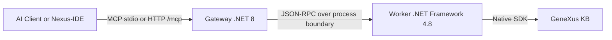

# GeneXus 18 MCP Server (Genexus18MCP)

[](https://lobehub.com/mcp/lennix1337-genexus18mcp)

A Model Context Protocol (MCP) server for GeneXus 18 with a .NET 8 gateway, a .NET Framework 4.8 worker, and a VS Code extension that operates directly against the MCP surface.

## Key Features

- Native GeneXus SDK integration through the worker process.
- MCP over stdio and HTTP at `/mcp`.
- MCP-first Nexus-IDE runtime for discovery, VFS, providers, commands, and shadow sync.
- Dynamic tool registry in `src/GxMcp.Gateway/tool_definitions.json`.
- HTTP session handling with protocol-version negotiation and SSE support.

## Nexus-IDE

The repository includes `src/nexus-ide`, a lightweight VS Code extension for GeneXus work:

- Virtual file system using the `genexus://` scheme
- KB explorer
- Multi-part editing for source, rules, events, and variables
- MCP discovery commands for tools, resources, and prompts

The extension uses `/mcp` directly. The legacy `/api/command` path has been removed from the gateway.

## Installation

### NPX (Fastest)

If you have Node.js installed, you can run the server directly from the npm registry without cloning the repository! Just create your "config.json" file in any directory and run:

`ash
npx genexus-mcp
``n
For **Claude Desktop** or other MCP clients, simply configure it like this:

`json
"genexus": {
  "command": "npx",
  "args": ["-y", "genexus-mcp"],
  "env": {
    "GX_CONFIG_PATH": "C:\\path\\to\\your\\config.json"
  }
}
``n
### One-Click (From Source)

1. Clone the repository.
2. Run `.\setup.bat` (Windows).
   - This will check prerequisites, build all components, and configure your local tools (Claude, Codex, Antigravity, and Cursor/Cline when detected).
3. If GeneXus or your KB are not auto-detected, follow the prompts to provide the paths.
4. Restart your AI tools/IDE to pick up the new MCP server.

### Agent-Led Installation (for AI Assistants)

If you are using an AI agent (like Antigravity, Cline, or Roo), copy and paste the following prompt to have it handle everything for you:

> [!TIP]
> **Copy-Paste to your Agent:**
> "Install the GeneXus MCP server in this repository.
> 1. Auto-detect the GeneXus 18 installation path and the local KB path.
> 2. Run `.\install.ps1` to build and register the server.
> 3. Verify the `config.json` is valid.
> 4. Update your own MCP configuration to include the 'genexus' server using the generated `start_mcp.bat`."

### Manual path

Notes:

- The installer updates `config.json`, builds the gateway/worker, packages `src/nexus-ide/nexus-ide.vsix`, configures Claude Desktop and Codex, and updates Antigravity plus Cursor/Cline settings when those clients are present.
- `setup.bat` is a thin bootstrap wrapper that launches `install.ps1` through PowerShell with `-ExecutionPolicy Bypass`.
- Automatic extension installation works with the editor CLIs found in `PATH` among `code`, `code-insiders`, `cursor`, `codium`, and `antigravity`. If none are present, install the generated `.vsix` manually.
- The desktop launcher at `publish/start_mcp.bat` exports `GX_CONFIG_PATH` and reuses the current repository gateway build when available, so local MCP clients and the extension share the repository-root `config.json`.
- `build.ps1` now refreshes both the publish/runtime artifacts and the debug-consumed artifacts in one pass, so `F5` and external MCP clients stop drifting onto different gateway/worker builds.
- The gateway now registers a local process lease keyed by `HttpPort + KBPath + InstallationPath + ShadowPath`, so duplicate launches can reuse a healthy live gateway instead of spawning another one.
- The worker now starts lazily on the first real command and shuts down automatically after the configured idle timeout, which prevents idle `GxMcp.Worker.exe` instances from lingering and locking the build output.

### Development build

```powershell
.\build.ps1
```

## Configuration

Edit `config.json`:

```json
{
  "Server": {
    "HttpPort": 5000,
    "BindAddress": "127.0.0.1",
    "AllowedOrigins": [],
    "SessionIdleTimeoutMinutes": 10,
    "WorkerIdleTimeoutMinutes": 5
  },
  "GeneXus": {
    "InstallationPath": "C:\\Program Files (x86)\\GeneXus\\GeneXus18",
    "WorkerExecutable": "worker\\GxMcp.Worker.exe"
  },
  "Environment": {
    "KBPath": "C:\\KBs\\YourKB"
  }
}
```

## Correct MCP Usage

Official transports:

- stdio MCP for desktop clients
- HTTP MCP at `http://127.0.0.1:5000/mcp`

HTTP MCP rules:

1. Send `initialize` first.
2. Include `MCP-Protocol-Version: 2025-06-18`.
3. Persist and reuse the returned `MCP-Session-Id`.
4. Use discovery methods before hardcoding assumptions: `tools/list`, `resources/list`, `resources/templates/list`, `prompts/list`.
5. Execute work with `tools/call`, `resources/read`, and `prompts/get`.
6. Use `GET /mcp` for SSE notifications when needed.
7. Use `DELETE /mcp` to close the session.

The gateway is MCP-only on HTTP. Use `/mcp`.

## Process Lifecycle

- Gateway reuse is controlled by a local lease under `%LOCALAPPDATA%\\GenexusMCP\\gateway-leases`.
- The launcher validates the lease identity and only removes stale or dead instances for that exact identity instead of killing every gateway/worker process.
- The gateway stays resident by default; the worker is started on demand and is stopped after `Server.WorkerIdleTimeoutMinutes` of inactivity when there are no queued or in-flight requests.

## Tool Surface

See `GEMINI.md` for guidance. The main MCP tools are:

- `genexus_query`
  - supports optional `typeFilter` and `domainFilter` for server-side narrowing before ranking/truncation
  - `genexus_read`
  - defaults to a source-first first page for MCP clients when `offset` and `limit` are omitted
  - `genexus_batch_read`
- `genexus_edit`
- `genexus_batch_edit`
- `genexus_open_kb`
- `genexus_inspect`
- `genexus_analyze`
- `genexus_inject_context`
- `genexus_lifecycle`
- `genexus_get_sql`
- `genexus_test`
- `genexus_create_object`
- `genexus_export_object`
- `genexus_import_object`
- `genexus_refactor`
- `genexus_add_variable`
- `genexus_explain_code`
- `genexus_summarize`
- `genexus_forge`
- `genexus_format`
- `genexus_properties`
- `genexus_asset`
- `genexus_history`
- `genexus_structure`
- `genexus_doc`

`genexus_asset` is metadata-first by design. Use `action='read'` with `includeContent=true` only when the file is small enough to fit the MCP context budget. For larger assets, read metadata only and keep `maxBytes` explicit.

`genexus_read` and `genexus_edit` also support XML metadata parts such as `Layout`, `WebForm`, and `PatternInstance`. For WorkWithPlus-owned panels, `PatternInstance` resolves through the authoritative `WorkWithPlus{Name}` object instead of the parent WebPanel preview.

`genexus_open_kb` switches the active Knowledge Base for the current worker session. `genexus_export_object` writes an object part to a text file, and `genexus_import_object` reads a text file and applies it to the requested object part through the same write path used by `genexus_edit`.

## Architecture



## Runtime Lifecycle

- The gateway now writes a local lease keyed by `HttpPort + KBPath + InstallationPath + GX_SHADOW_PATH` and exits early when an identical live instance already owns that key.
- Nexus-IDE reuses the leased gateway instead of relying only on a port probe, and startup cleanup is now selective to the leased PID instead of broad `taskkill` sweeps.
- The worker is lazy: the gateway creates the worker on the first real command instead of at gateway boot.
- The worker shuts down automatically after `Server.WorkerIdleTimeoutMinutes` of inactivity, then starts again on the next command.
- Gateway lease files live under `%LOCALAPPDATA%\\GenexusMCP\\gateway-leases`.

## Current State

- The extension is MCP-first.
- The gateway and worker remain the production architecture.
- The HTTP transport is MCP-only at `/mcp`.
