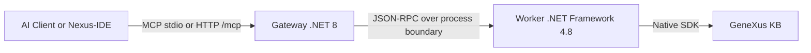

# GeneXus 18 MCP Server (Genexus18MCP)

[](https://lobehub.com/mcp/lennix1337-genexus18mcp)

A high-performance Model Context Protocol (MCP) server for GeneXus 18. It integrates native GeneXus SDK access via a .NET 8 gateway and a .NET Framework 4.8 worker, exposing direct read/write/analysis operations directly to AI Agents and IDEs.

***

## 🚀 Quick Start (For AI Agents)

You **do not** need to clone this repository or install anything globally if you have Node.js installed. You can configure your AI Assistant (Claude Desktop, Cursor, RooCode, etc.) to fetch and run the server dynamically!

### 1. Create your Local Config
Create a `config.json` inside your working directory telling the AI where your GeneXus is installed and which Knowledge Base you want to interact with:

```json
{
  "GeneXus": { 
    "InstallationPath": "C:\\Program Files (x86)\\GeneXus\\GeneXus18" 
  },
  "Environment": { 
    "KBPath": "C:\\KBs\\YourKB" 
  }
}
```

### 2. Configure your AI Assistant
Add the `mcpServers` configuration block into your AI tool (e.g. `claude_desktop_config.json`):

```json
"mcpServers": {
  "genexus": {
    "command": "npx",
    "args": ["-y", "genexus-mcp"],
    "env": {
      "GX_CONFIG_PATH": "C:\\path\\to\\your\\config.json"
    }
  }
}
```
**That's it!** The AI will automatically download the compiled Windows gateway in the background and bridge the logic directly to your local GeneXus!

---

## 🛠️ Tool Surface (Skills)
*(See `GEMINI.md` for extended guidelines).* The worker natively exposes the following tools to the MCP Router:

- **Search & Discovery**: `genexus_query`, `genexus_read`, `genexus_batch_read`, `genexus_inspect`, `genexus_list_objects`, `genexus_properties`
- **Editing & Architecture**: `genexus_edit`, `genexus_batch_edit`, `genexus_create_object`, `genexus_refactor`, `genexus_forge`
- **Analysis:** `genexus_analyze`, `genexus_inject_context`, `genexus_doc`, `genexus_explain_code`, `genexus_summarize`
- **File System & Assets**: `genexus_asset`, `genexus_export_object`, `genexus_import_object`
- **History & DB**: `genexus_history`, `genexus_get_sql`, `genexus_structure`
- **Lifecycle & Build**: `genexus_lifecycle`, `genexus_test`, `genexus_format`
- **Patterns**: Smart XML generation and interpretation (e.g., WorkWithPlus PatternInstance mapping).

---

## 💻 Development & Building from Source

If you want to contribute, build the project yourself, or use the local **Nexus-IDE** VS Code Extension, use the classic source-based workflow.

### One-Click Build
1. Clone the repository to your Windows machine.
2. Run `.\setup.bat`.
   * *This checks prerequisites, builds the C# components, and auto-registers the local server with Claude, Codex, Antigravity, and Cursor when detected.*
3. If GeneXus or your KB are not auto-detected, follow the terminal prompts.

### Nexus-IDE (VS Code)
The repository includes `src/nexus-ide`, a lightweight VS Code extension containing:
- Virtual file system using the `genexus://` scheme
- Dynamic KB explorer with multi-part editing (Source, Rules, Events, Variables)
- Built-in MCP discovery commands (tools, resources, prompts)

### Advanced Configuration
You can expand your local `config.json` for advanced networking or timeouts:

```json
{
  "Server": {
    "HttpPort": 5000,
    "BindAddress": "127.0.0.1",
    "SessionIdleTimeoutMinutes": 10,
    "WorkerIdleTimeoutMinutes": 5
  },
  "GeneXus": {
    "InstallationPath": "C:\\Program Files (x86)\\GeneXus\\GeneXus18",
    "WorkerExecutable": "worker\\GxMcp.Worker.exe"
  },
  "Environment": {
    "KBPath": "C:\\KBs\\YourKB"
  }
}
```

### Process Lifecycle & Architecture
- **Lazy Worker Mapping:** The .NET 8 Gateway is resident, but the heavy .NET 4.8 Worker is lazy (only spins up when the first standard command is received) and automatically terminates after `Server.WorkerIdleTimeoutMinutes` of inactivity to unlock build artifacts.
- **Gateway Reuse**: Launching multiple local IDE instances reuses a single active gateway using a unique lease file located at `%LOCALAPPDATA%\GenexusMCP\gateway-leases`.
- **HTTP Mode**: Run via HTTP at `http://127.0.0.1:5000/mcp` (Supports SSE notifications alongside standard POST JSON-RPC). Protocol expects `MCP-Protocol-Version: 2025-06-18`.


