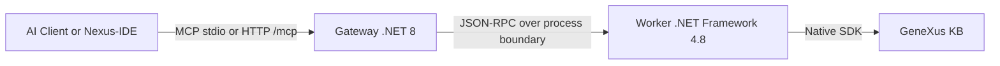

# GeneXus 18 MCP Server (Genexus18MCP)

[](https://lobehub.com/mcp/lennix1337-genexus18mcp)

A high-performance Model Context Protocol (MCP) server for GeneXus 18. It integrates native GeneXus SDK access via a .NET 8 gateway and a .NET Framework 4.8 worker, exposing direct read/write/analysis operations directly to AI Agents and IDEs.

***

## 🚀 Quick Start (Installation & Configuration)

You **do NOT** need to clone this repository, and you **do NOT** need to install anything globally via `npm i -g`. The standard Node.js `npx` runner will dynamically fetch and launch the compiled gateway for you.

### Step 1: Configure (Non-Interactive First)

To initialize configuration in a deterministic, agent-friendly way:

```bash
npx genexus-mcp@latest init --kb "C:\KBs\YourKB" --gx "C:\Program Files (x86)\GeneXus\GeneXus18"
```

If you want the setup wizard prompts explicitly, run:

```bash
npx genexus-mcp@latest init --interactive
```

### Step 2: Restart your AI Assistant

Once the wizard outputs `🎉 You are all set!`, simply **Restart** or **Refresh** your AI Assistant (Claude Desktop, Antigravity, Cursor, etc.). The AI will automatically spin up the server in the background and connect.

---

### 🤖 Auto-Installer Prompt (Copy & Paste to your AI)

If you want your AI Assistant to install and configure everything itself without you touching the terminal, copy and paste this exact prompt into your chat window:

```markdown
Please configure your Model Context Protocol (MCP) server to connect to my GeneXus Knowledge Base by following these exact steps:

1. Run the command `npx genexus-mcp@latest init` directly in the terminal in non-interactive mode using this configuration format (do not use interactive prompts). You must inject my raw KB path and GX path via environment variables or a direct config patch if needed, or simply let the zero-config auto-discovery handle it if we are already in the KB folder.
2. If I haven't told you my GeneXus path or KB path, STOP and ask me for them now.
3. Once the setup is complete, read the generated JSON block from the console output.
4. If you use a global configuration file (like `mcp_config.json` or `claude_desktop_config.json`), insert the exact `mcpServers` block provided in the console output. Use `npx.cmd` as the command.
5. Provide a summary of the installation and notify me when you are ready to query GeneXus!
```

---

## AXI CLI Commands

The package now includes agent-facing commands optimized for shell automation:

```bash
genexus-mcp status
genexus-mcp doctor
genexus-mcp tools list
genexus-mcp config show
```

Global AXI flags:
- `--format toon|json|text` (default for AXI commands: `toon`)
- `--fields f1,f2,...` (minimal schema by default; request extra fields explicitly)
- `--limit <n>` (for list commands)
- `--query <text>` (for `tools list`)
- `--full` (expand truncated long-form content when supported)
- `--quiet` and `--no-color` (agent-safe output control)

Notes:
- Structured data/errors are emitted on `stdout`.
- Diagnostic/progress output stays on `stderr`.
- Use `genexus-mcp <command> --help` for command-specific usage/examples.
- Output metadata includes `meta.schemaVersion` for contract stability.
- Running `genexus-mcp` without an AXI subcommand keeps the original MCP gateway launcher behavior.
- Full LLM-facing AXI contract: [`docs/axi_cli_contract.md`](docs/axi_cli_contract.md)

---

## 🛠️ Tool Surface (Skills)
*(See `GEMINI.md` for extended guidelines).* The worker natively exposes the following tools to the MCP Router:

- **Search & Discovery**: `genexus_query`, `genexus_read`, `genexus_batch_read`, `genexus_inspect`, `genexus_list_objects`, `genexus_properties`
- **Editing & Architecture**: `genexus_edit`, `genexus_batch_edit`, `genexus_create_object`, `genexus_refactor`, `genexus_forge`
- **Analysis:** `genexus_analyze`, `genexus_inject_context`, `genexus_doc`, `genexus_explain_code`, `genexus_summarize`
- **File System & Assets**: `genexus_asset`, `genexus_export_object`, `genexus_import_object`
- **History & DB**: `genexus_history`, `genexus_get_sql`, `genexus_structure`
- **Lifecycle & Build**: `genexus_lifecycle`, `genexus_test`, `genexus_format`
- **Patterns**: Smart XML generation and interpretation (e.g., WorkWithPlus PatternInstance mapping).

---

## 💻 Development & Building from Source

If you want to contribute, build the project yourself, or use the local **Nexus-IDE** VS Code Extension, use the classic source-based workflow.

### One-Click Build
1. Clone the repository to your Windows machine.
2. Run `.\setup.bat`.
   * *This checks prerequisites, builds the C# components, and auto-registers the local server with Claude, Codex, Antigravity, and Cursor when detected.*
3. If GeneXus or your KB are not auto-detected, follow the terminal prompts.

### Nexus-IDE (VS Code)
The repository includes `src/nexus-ide`, a lightweight VS Code extension containing:
- Virtual file system using the `genexus://` scheme
- Dynamic KB explorer with multi-part editing (Source, Rules, Events, Variables)
- Built-in MCP discovery commands (tools, resources, prompts)

### Advanced Configuration
You can expand your local `config.json` for advanced networking or timeouts:

```json
{
  "Server": {
    "HttpPort": 5000,
    "BindAddress": "127.0.0.1",
    "SessionIdleTimeoutMinutes": 10,
    "WorkerIdleTimeoutMinutes": 5
  },
  "GeneXus": {
    "InstallationPath": "C:\\Program Files (x86)\\GeneXus\\GeneXus18",
    "WorkerExecutable": "worker\\GxMcp.Worker.exe"
  },
  "Environment": {
    "KBPath": "C:\\KBs\\YourKB"
  }
}
```

### Process Lifecycle & Architecture
- **Lazy Worker Mapping:** The .NET 8 Gateway is resident, but the heavy .NET 4.8 Worker is lazy (only spins up when the first standard command is received) and automatically terminates after `Server.WorkerIdleTimeoutMinutes` of inactivity to unlock build artifacts.
- **Gateway Reuse**: Launching multiple local IDE instances reuses a single active gateway using a unique lease file located at `%LOCALAPPDATA%\GenexusMCP\gateway-leases`.
- **HTTP Mode**: Run via HTTP at `http://127.0.0.1:5000/mcp` (Supports SSE notifications alongside standard POST JSON-RPC). Protocol expects `MCP-Protocol-Version: 2025-06-18`.


